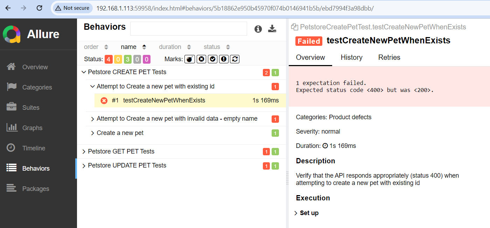

This is an example project for the Commbank coding challenge.

## Overview

This project utilizes the following technologies:

- Maven as a build tool
- Java 11
- Rest Assured for API testing
- BDD approach with Allure Reports for better observability
- GitLab for CI/CD

### Local Execution

To run the project locally, follow these steps:

1. Clone the project
2. Run locally to run all the tests:
- mvn clean test
3. Execute from terminal (root/allure-results) to see the Allure report
- allure serve

#### Report example:
- 
### To run from CI/CD (GITLAB)
1. Visit GitLab:
Open this project on the GitLab website.

2. Navigate to CI/CD Pipelines:
Go to your project and navigate to "CI/CD > Pipelines" in the GitLab UI. You'll see the pipeline(s) triggered by your recent commit.

3. Monitor Pipeline Execution:
GitLab will automatically start executing the pipeline stages defined in your .gitlab-ci.yml file. You can monitor the progress of the pipeline, view logs, and check for any issues.

4. View Results:
Once the pipeline is complete, you can check the results, including whether the tests passed or failed. If there are any issues, you can inspect the logs to identify the problem.

5. Access Artifacts:
Access Allure reports in artefact, 
6. Run allure serve from the dir where you uploaded your allure-results
