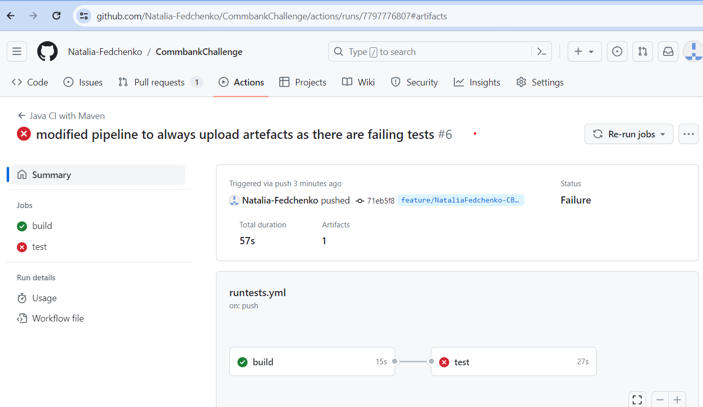

This is an example project for the Commbank coding challenge.
Please note that I did cover only few existing APIs as a sample
There are more tests to be added for comprehansive coverage.

## Overview

This project utilizes the following technologies:

- Maven as a build tool
- Java 11
- Rest Assured for API testing
- BDD approach with Allure Reports for better observability
- GitLab for CI/CD

### Local Execution

To run the project locally, follow these steps:

1. Clone the project
2. Run locally to run all the tests:
- mvn clean test
3. Execute from terminal (root/allure-results) to see the Allure report
- allure serve

#### Report example:
- 
### To run from CI/CD (GITLAB)
1. Visit GitLab:
Open this project on the GitLab website.
 - https://github.com/Natalia-Fedchenko/CommbankChallenge/actions/runs/7797776807#artifacts
2. Click on re-run

3. Access Artifacts:
Access Allure reports in artefact below the page, 
4. Run allure serve from the dir where you uploaded your allure-results
